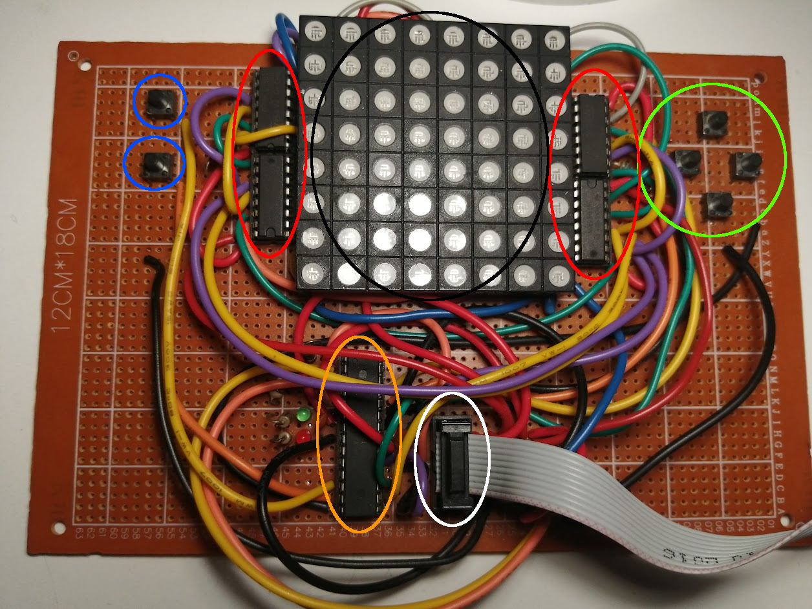
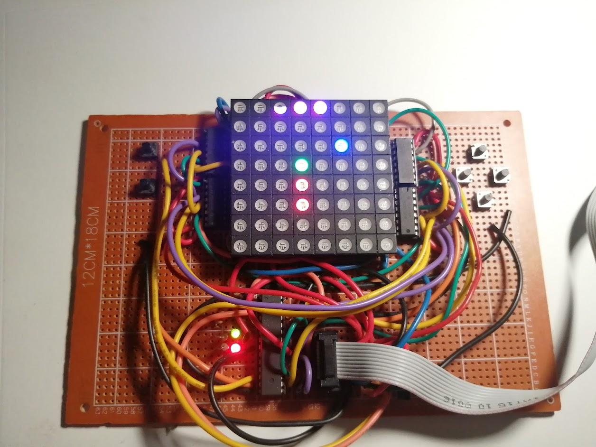
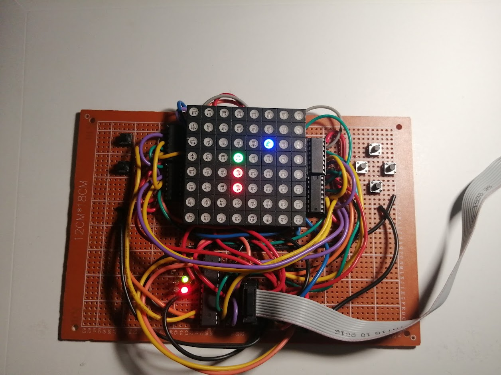

# Opis

Konsola do gier na wyświetlaczu matrix 8x8.

Konsola jest wyposażona w wyświetlacz matrix 8x8 zaznaczony kolorem czarnym.

Znjadują się również 4 rejestry przesuwne **75hc595**. Zaznaczone kolorem czerowonym.

Wykorzystany jest mikrokontroler AVR amtega8a z taktowaniem 8MHz z wewnetrznego oscylatora. Został on zaznaczony kolorem pomarańczowym

Oraz w 6 przycisków.

Całość jest zasilana z pomocą programtora USBasp napięciem 5v.
Złącze zasilania oraz programowania jest zaznaczone kolorem białym.

## Przyciski

Są podzielone na dwie sekcje wyboru oraz poruszania
### Wybór

Klawisze wyboru są zaznaczone kolorem niebieskim. Górny odpowiada za opcje "potwierdź", dolny za "cofnij"

### Poruszanie się

Klawisze zaznaczone w kolorze zielonym opowiadają za np. poruszanie się po menu, wybór poziomu trudności czy ruch obiektów w grze.

Zaimplementowana została gra "Snake"

## Snake

Możliwy jest wybór prędkości, za pomocą klawiszy "lewo"/"prawo" im więcej zapalonych diod w górnym rzędzie tym szybciej wąż będzie się poruszał.

### Start

Po zatwierdzeniu poziomu klawiszem "akceptuj", gra się załaduję i będzie oczekiwać na kliknięcie przycisku ruchu.

### Funkcje

Gracz może zatrzymać grę za pomocą klawisza "anuluj", wznowienie gry jest możliwe za pomocą klawiszy ruchu.

Wąż ma dwa życia, po zdrzeniu się samym ze sobą to gra cofa nas o dwa ruchy(wykorzystany wzorzec pamiątki).

Elementy do "zjedzenia" przez węzą sa losowane. Dokładniej współrzędne X oraz Y są losowane przy pomocy przetwornika ADC. Działa on w tle jako "zbieracz szumu" i na podstawie zebranej wartości i działań matematycznych można uzyskać losowe rozmieszczenie elementów.

### Prezentacja

## Technologia

Przy pisaniu tej aplikacji zostanie wykorzystany język c++, wzorce projektowe oraz wzorzec MVC

## Wzorce projektowe

1. Mediator - wywołuję odpowiednie części kodu na zdarzenie kliknięcia przycisku.
2. Listener - sprawdza co ustaloną liczbę mS kolejkę stanu klawiszy, przy kliknięciu jakiegoś informuje o tym mediator.
3. Stan - konsola może być w stanach np. ładowania, wyboru gry, wyboru poziomu trudności, gra właściwa itd.
4. Fasada - np. fasada przycisków, obsługuję klikniecie przyciku, dodając go kolejki, którą obsługuję Listener.
5. MVC - model, view, controller. Wyświetlanie, obsługa klawiszy, adc, logika gry są podzielone na osobne byty, które nie są że sobą sztywno połączone. Controller odpowiada za przepływ informacji z modelu do view.
6. Pamiątka - zapamietywanie stanu gry przed zderzeniem.